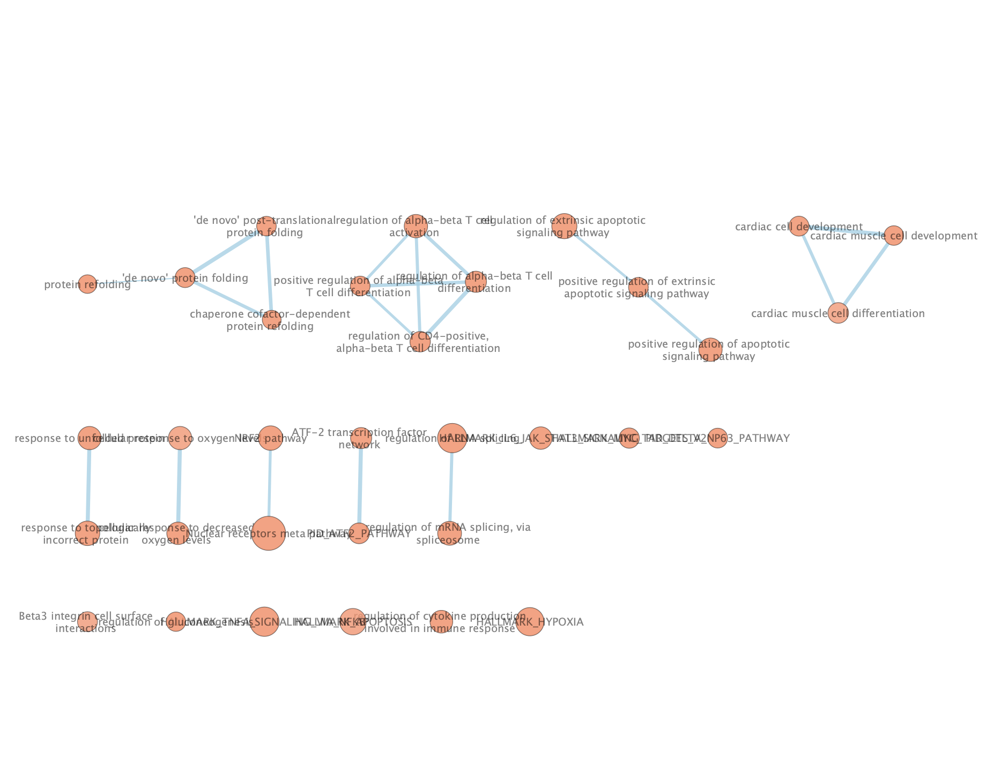
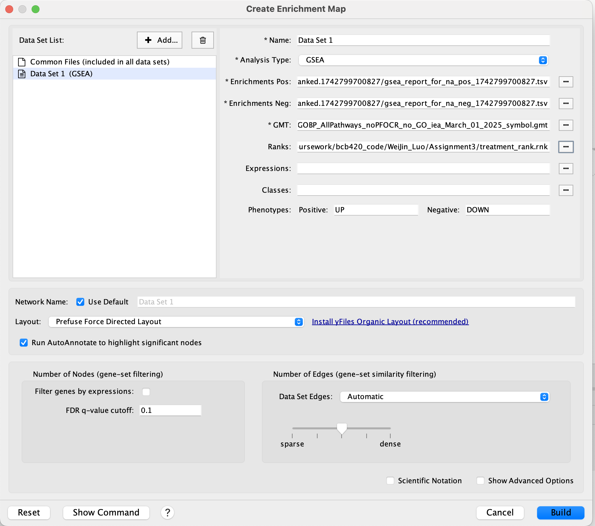
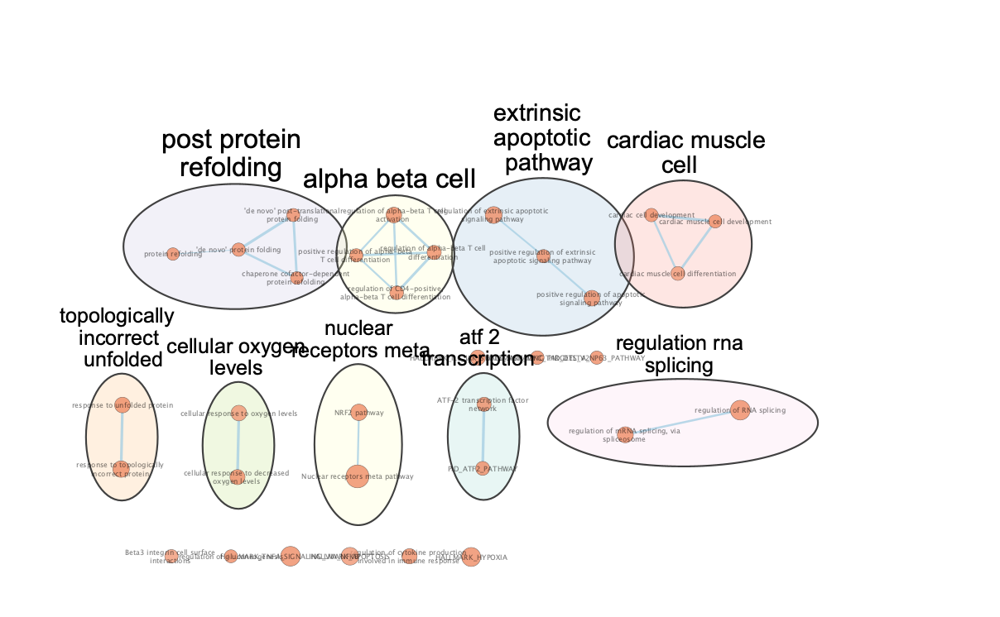
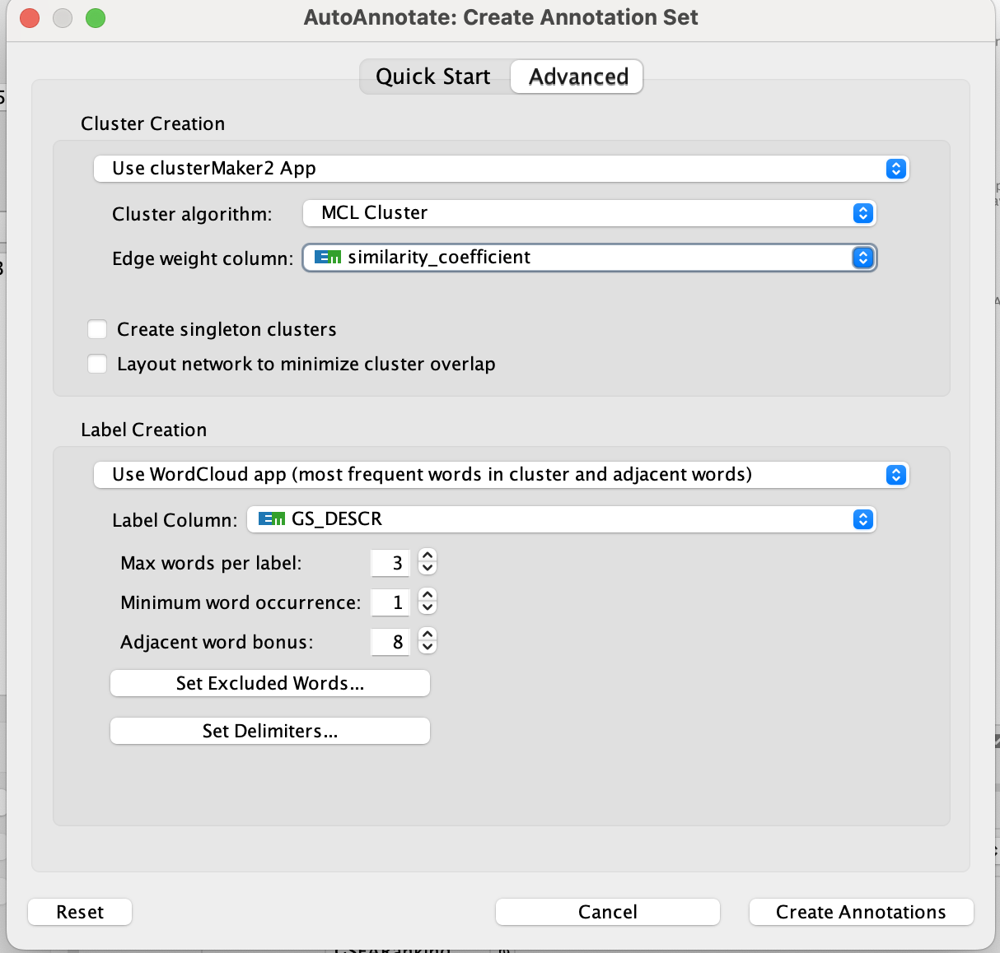
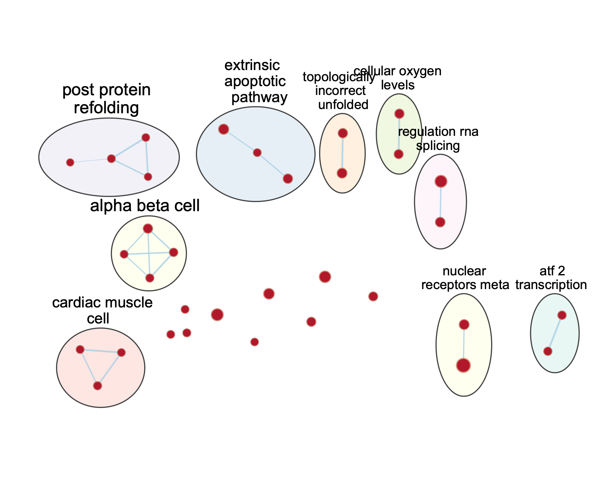
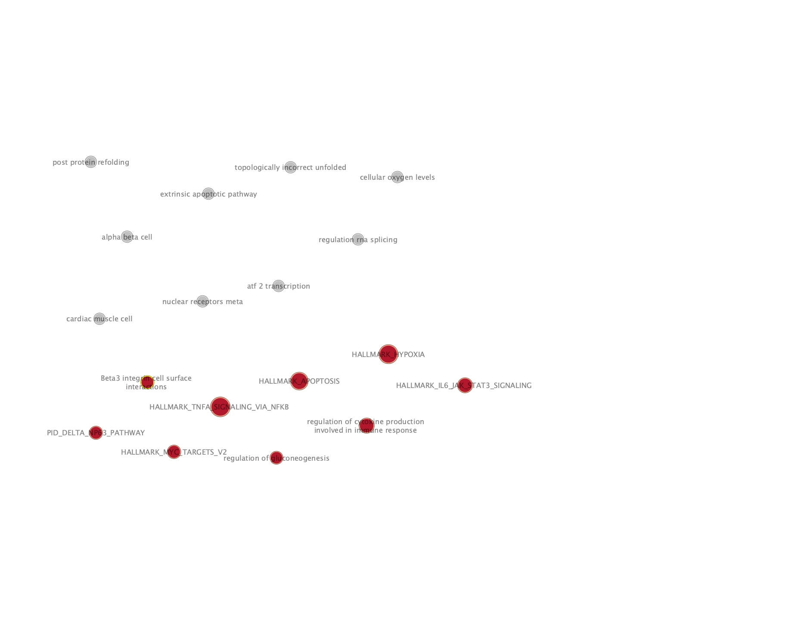
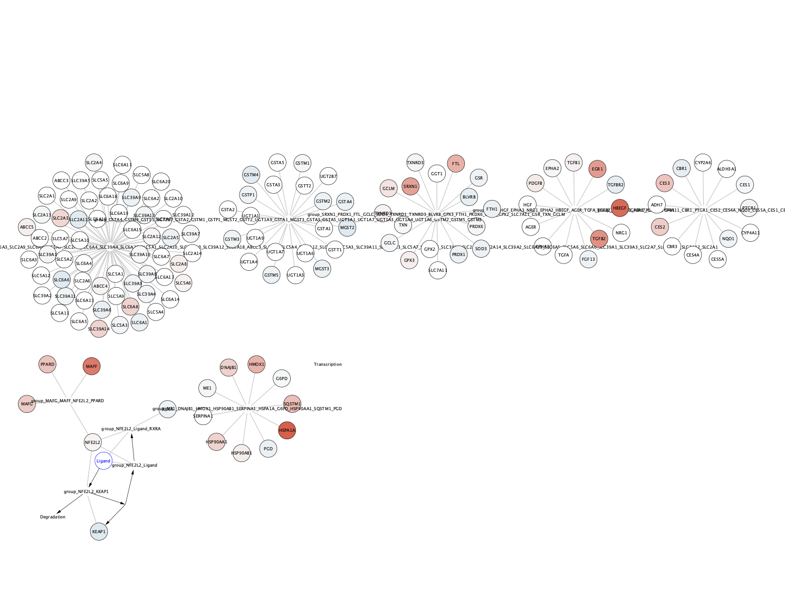

# Introduction
Task: Take the ranked data that was created in Assignment #2 and perform non-thresholded pathway analysis. Once you performed pathways analysis you summarize and visualize your results using Cytoscape and the Enrichment map pipeline.

## Background from A1 & A2
The data used in this analysis was taken from the [GEO](https://www.ncbi.nlm.nih.gov/geo/) database and has the accession number [GSE195585](https://www.ncbi.nlm.nih.gov/geo/query/acc.cgi?acc=GSE195585). The data is associated with this [paper](https://pmc.ncbi.nlm.nih.gov/articles/PMC9037237)[@Centner2022], where the effects of collagen peptides (CP) combined with high-load resistance exercise on gene expression related to muscle protein synthesis was studied.

For A1, we performed the following:
- Computed overview statistics to assess data quality for the control and test conditions in the dataset
- Map the original Gene symbols to HUGO gene symbols and handle any missing symbols/ duplicates
- Cleaned the data by removing any outliers
- Applied normalization

The final after A1 was a dataset that has HUGO gene symbols as row names, sample names as columns and the normalized expression for each gene for each respective sample

For A2, we performed the following:
- Conducted differential expression analysis with the dataset from A1
- Visualized top hits 
- Performed Thresholded over-representation analysis

After the ORA in Assignment 2 we were able to generate a list of ranked genes. In A3 we will be using the ranked set of genes for the non-thresholded gene set enrichment analysis.

## Installing packages
```{r, error=FALSE, message=FALSE, warning=FALSE}
# Check if Biocondutor is installed
if (!requireNamespace("BiocManager", quietly = TRUE))
    install.packages("BiocManager")

# Install knitr
if (!requireNamespace("knitr", quietly = TRUE))
    install.packages("knitr")

tryCatch(expr = { library("RCurl")}, 
         error = function(e) {  
           install.packages("RCurl")}, 
         finally = library("RCurl"))
```

# Thresholded Gene Set Enrichment Analysis
To get our ranked set of genes I will re-render my code from A2 to get the ranked set of genes needed for this assignment
```{r, include = FALSE}
rmarkdown::render("~/projects/bcb420_code/WeiJin_Luo/Assignment2/A2_weijinluo.Rmd")
```

# Non-thresholded Gene Set Enrichment Analysis

## Generating rank file
Firstly, we need to create our rank file. In order to do this, I will use the results from the differential expression analysis of the treatment group. Referencing this [code](https://baderlab.github.io/Cytoscape_workflows/EnrichmentMapPipeline/supplemental_protocol1_rnaseq.html) from the Bader Lab.
```{r}
# Compare Verum 4h vs. Verum 0h
rank_genes <- topfit_Verum$table

ranks_RNAseq <- sign(rank_genes$logFC) * -log10(rank_genes$PValue)

# Extract gene names (already in rownames)
genenames <- rownames(rank_genes)

# Create ranks file
ranks_RNAseq <- cbind(genenames, ranks_RNAseq)
colnames(ranks_RNAseq) <- c("GeneName", "rank")

# Sort ranks in decreasing order
ranks_RNAseq <- ranks_RNAseq[order(as.numeric(ranks_RNAseq[, 2]), decreasing = TRUE), ]

# Save the ranks file
write.table(ranks_RNAseq, file = "treatment_rank.rnk", 
            col.names = TRUE, sep = "\t", row.names = FALSE, quote = FALSE)
```

## Downloading gmt File
Next we will download the gmt file from Dr Gary Bader's lab website
```{r}
dest_gmt_file = ""

if(dest_gmt_file == ""){
  gmt_url = "http://download.baderlab.org/EM_Genesets/current_release/Human/symbol/"
  
  #list all the files on the server
  filenames = getURL(gmt_url)
  tc = textConnection(filenames)
  contents = readLines(tc)
  close(tc)
  
  rx = gregexpr("(?<=<a href=\")(.*.GOBP_AllPathways_noPFOCR_no_GO_iea.*.)(.gmt)(?=\">)",
                contents, perl = TRUE)
  gmt_file = unlist(regmatches(contents, rx))
  
  dest_gmt_file <- file.path('.',gmt_file )
  
  #check if this gmt file already exists
  if(!file.exists(dest_gmt_file)){
    download.file(
      paste(gmt_url,gmt_file,sep=""),
      destfile=dest_gmt_file
    )
  }
}
```

## Running GSEA
First we will set up the variables
```{r}
gsea_output <- paste0(getwd(), "/gsea_results")
if (!dir.exists(gsea_output)) {
    dir.create(gsea_output)
}

# Path to rank file
rnk_file <- file.path(getwd(), "treatment_rank.rnk")

analysis_name <- "TreamentBaseline_vs_Treatment4h"
```

Finally we will run the GSEA
```{r}
gsea_jar = "/home/rstudio/GSEA_4.3.2/gsea-cli.sh"

command <- paste("", gsea_jar,
             "GSEAPreRanked -gmx", dest_gmt_file,
             "-rnk" ,file.path(getwd(), "treatment_rank.rnk"), 
             "-collapse false -nperm 1000 -scoring_scheme weighted", 
             "-rpt_label ", analysis_name,
             "  -plot_top_x 20 -rnd_seed 12345  -set_max 200",  
             " -set_min 15 -zip_report false ",
             " -out", gsea_output, 
             " > gsea_output.txt", sep=" ")

gsea_output_dir <- list.files(gsea_output)
gsea_output_path <- paste0(gsea_output, "/", gsea_output_dir)
gsea_result_files <- list.files(gsea_output_path)
if (length(gsea_result_files) == 0) {
    system(command)
  
    gsea_output_dir <- list.files(gsea_output)
    gsea_output_path <- paste0(gsea_output, "/", gsea_output_dir)
    gsea_result_files <- list.files(gsea_output_path)
} else {
    message("GSEA results already exist.")
}
```

## GSEA Results
```{r}
gsea_report_files <- grep("^gsea_report_for_.*\\.tsv$", gsea_result_files, value = TRUE)

na_pos_file <- paste0(gsea_output_path, "/", gsea_report_files[grep("na_pos", gsea_report_files)])
na_neg_file <- paste0(gsea_output_path, "/", gsea_report_files[grep("na_neg", gsea_report_files)])

na_pos_df <- read.delim(na_pos_file, sep = "\t", header = TRUE, stringsAsFactors = FALSE)
na_neg_df <- read.delim(na_neg_file, sep = "\t", header = TRUE, stringsAsFactors = FALSE)
```

## Questions

**1. What method was used to perform the GSEA? What gene sets did you use for your enrichment analysis?**

The GSEA was performed using version 4.3.2 from the pre-installed GSEA from the [Gary Bader Lab](https://hub.docker.com/r/risserlin/workshop_base_image). This analysis was performed using with the gene sets from `Human_GOBP_AllPathways_noPFOCR_no_GO_iea_March_01_2025_symbol.gmt` which was downloaded from the Bader lab. The input data we used were results of a differential expression analysis from A1 and this data was transformed into a rank file to input into GSEA

**2. Provide a summary of your enrichment results.**
```{r}
gsea_summary <- data.frame(
  Condition = c("Treatment Baseline", "Treatment 4h"),
  Total_Gene_Sets = c(nrow(na_pos_df), nrow(na_neg_df)),
  Significant_p005 = c(sum(na_pos_df$NOM.p.val < 0.05), sum(na_neg_df$NOM.p.val < 0.05)),
  Significant_p001 = c(sum(na_pos_df$NOM.p.val < 0.01), sum(na_neg_df$NOM.p.val < 0.01)),
  Significant_FDR005 = c(sum(na_pos_df$FDR.q.val < 0.05, na.rm = TRUE), 
                        sum(na_neg_df$FDR.q.val < 0.05, na.rm = TRUE)),
  Top_Term = c(na_pos_df$NAME[which.max(abs(na_pos_df$NES))], 
              na_neg_df$NAME[which.max(abs(na_neg_df$NES))])
)

colnames(gsea_summary) <- c("Condition", 
                           "Total Gene Sets", 
                           "p < 0.05", 
                           "p < 0.01", 
                           "FDR < 0.05",
                           "Top Enriched Term")

knitr::kable(
  gsea_summary,
  caption = "Summary of GSEA Results: Collagen Peptide Treatment Baseline vs 4h",
)
```

**4. Compare the results of this non-thresholded analysis to the thresholded analysis performed in Assignment 2.**
ORA Results from A2
```{r}
knitr::kable(ora_up_filtered[1:20, c("term_size", "term_name")], 
      row.names = FALSE, 
      caption = "**Top significant gene sets for ORA upregulated genes for the Treatment Group**")

knitr::kable(ora_down_filtered[1:20, c("term_size", "term_name")], 
      row.names = FALSE, 
      caption = "**Top significant gene sets for ORA downregulated genes for the Treatment Group**")

# Top upregulated gene sets
knitr::kable(na_pos_df[1:20, "NAME", drop = FALSE],
             row.names = FALSE, 
             caption = "Top GSEA Upregulated Gene Sets")

# Top downregulated gene sets 
knitr::kable(na_neg_df[1:20, "NAME", drop = FALSE],
             row.names = FALSE, 
             caption = "Top GSEA Downregulated Gene Sets")
```
We can see a lot of differences between the thresholded and non-thresholded analysis. 
Specifically, GSEA features a lot of protein folding and refolding whereas ORA focuses on apoptosis and muscle adaptation.

**5. Is comparing a non-thresholded vs. a thresholded analysis straightforward? Why or why not?**
Comparing non-thresholded and thresholded analyses is not straightforward because they use different approaches. GSEA analyzes all genes in a ranked list to detect subtle but coordinated expression changes across pathways, while ORA only considers statistically significant differentially expressed genes that pass predefined thresholds, focusing on stronger individual gene effects. Additionally, as we can see from the results, these analysis differ quite drastically with their outputs.


# Visualizing using Cytoscape

**1. Create an enrichment map - how many nodes and how many edges in the resulting map? What thresholds were used to create this map? Make sure to record all thresholds. Include a screenshot of your network prior to manual layout.**

We have 33 nodes and 20 edges. We have a q-value of 0.1, a p-value of 1 and the edge cutoff to be 0.375. The following map was generated. The rank file, and GSEA enrichment results were generated from the GSEA section of this assignment

 
 

**2. Annotate your network - what parameters did you use to annotate the network. If you are using the default parameters make sure to list them as well.**


The annotations were created using AutoAnnotate with the following parameters:

**3. Make a publication ready figure - include this figure with proper legends in your notebook.**

```{r, echo=FALSE, out.width="100%"}
knitr::include_graphics("./a3_cytoscape_figures/legend.pdf")
```

**4. Collapse your network to a theme network. What are the major themes present in this analysis? Do they fit with the model? Are there any novel pathways or themes?**

A major theme that we see in the collapsed network that aligns with the model is ATF2 Transcription. ATF2 is a downstream effector of the MAPK pathway, which was significantly upregulated in the study, thus it makes sense to see ATF2 Transcription in the network  [@Chaveroux2009].

Some novel themes would be Nuclear receptors meta and the NFR2 pathway. This was never mentioned in the original paper, however, it seems like the NFR2 can be activated in response to mechanical stress[@Xi2022] like the stress involved in resistance training. Thus it's also interesting to see that theme present in our enrichment map

# Interpretation Questions
**1. Do the enrichment results support conclusions or mechanism discussed in the original paper? How do these results differ from the results you got from Assignment #2 thresholded methods**
The enrichment look like they broadly support the conclusions discussed in the original paper, one such example would be the ATF2 transcription that we see as a major theme in the enrichment results ATF2 is a downstream effector of MAPK signaling, linking directly to the paper’s findings.

As for comparing between the results from Assignment 2, we do see some overlap in terms of apoptotic signaling, where we see a lot of those in the upregulated ORA results, we also see a extrinsic apoptoic pathway theme in the enrichment map. We also see some overlap in nuclear receptor-mediated signaling pathway, which we can see in the ORA results as well as the enrichment map.

**2. Can you find evidence, i.e. publications, to support some of the results that you see. How does this evidence support your result?**
As discussed in the themes analysis, this paper discusses how the MAPK pathway can trigger ATF2 phosphorylation, supports how we can see the ATF2 pathway in our enrichment results [@Chaveroux2009]. Additionally we can see how NFR2 can be activated under mechanical stress in this paper [@Xi2022]. There is also evidence that NFR2 pathway also plays a role in the maintenance of skeletal muscle mass [@Zhang2024]

## Post Analysis
For the post analysis I wanted to investigate the NFR2 pathway in more detail. I chose this pathway because it's not mentioned in the original paper, but it seems like it does have a role in muscle development and maintence as mentioned previously [@Zhang2024]. I decided to visualize the pathway using Wikipathways and I annotated the network using the rank file that I generated as part of the GSEA analysis. We can see the strength of the differential expression. In the diagram, blue represent what is downregulated, and red represents whats upregulated


# References


